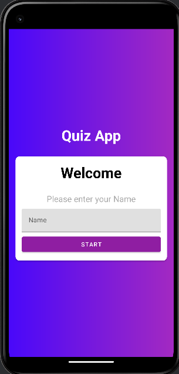
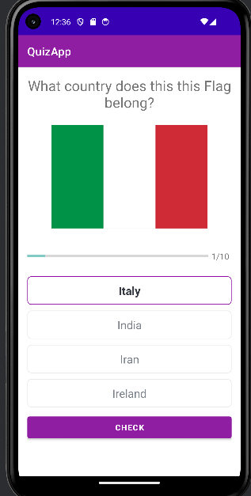
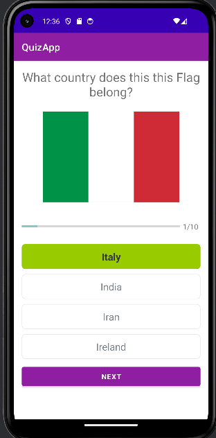
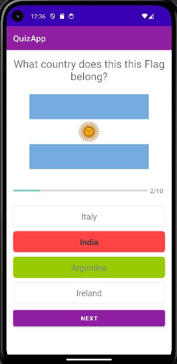
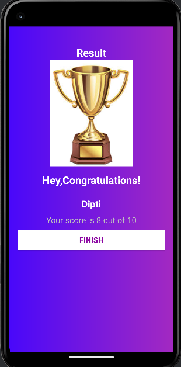

# 📱 Quiz App

<p align="center">
  <b>A modern Android Quiz Application built using Kotlin and XML.</b><br>
  Test your knowledge with multiple-choice questions, instant answer validation, progress tracking, and a beautiful result screen.
</p>

---

## ✨ Features

- 👤 Enter player name before starting the quiz
- 🌍 Multiple-choice country flag questions
- ✅ Instant feedback for correct answers
- ❌ Highlights wrong answers with the correct answer
- 📊 Question progress indicator
- 🏆 Final score and result screen
- 🎨 Clean Material UI
- ⚡ Fast and lightweight

---

## 📱 Application Screens

<p align="center">

## 📱 Application Screens

| Welcome | Quiz Question | Correct Answer | Wrong Answer | Result |
|:-------:|:-------------:|:--------------:|:------------:|:------:|
|  |  |  |  |  |

</p>

---

## 🚀 Application Flow

```
Launch App
      │
      ▼
Enter Player Name
      │
      ▼
Start Quiz
      │
      ▼
Answer 10 Questions
      │
      ▼
Instant Feedback
(Green = Correct)
(Red = Wrong)
      │
      ▼
Next Question
      │
      ▼
View Final Score
      │
      ▼
Finish Quiz
```

---

## 🛠 Tech Stack

- Kotlin
- Android Studio
- XML Layouts
- Material Components
- RecyclerView
- ConstraintLayout
- Android SDK

---

## 📂 Project Structure

```text
Quiz-App
├── app
│   ├── manifests
│   │   └── AndroidManifest.xml
│   │
│   ├── kotlin+java
│   │   └── com.example.quizapp
│   │       ├── model
│   │       │   └── Question.kt
│   │       │
│   │       ├── ui
│   │       │   ├── QuestionsActivity.kt
│   │       │   └── ResultActivity.kt
│   │       │
│   │       ├── utils
│   │       │   └── Constants.kt
│   │       │
│   │       └── MainActivity.kt
│   │
│   ├── res
│   │   ├── drawable
│   │   │   ├── Country Flag Images
│   │   │   ├── Trophy Image
│   │   │   ├── Backgrounds
│   │   │   └── Option Border Drawables
│   │   │
│   │   ├── layout
│   │   │   ├── activity_main.xml
│   │   │   ├── activity_questions.xml
│   │   │   └── activity_result.xml
│   │   │
│   │   ├── mipmap
│   │   ├── values
│   │   │   ├── colors.xml
│   │   │   ├── strings.xml
│   │   │   └── themes.xml
│   │   │
│   │   └── xml
│   │
│   └── build.gradle.kts
│
├── screenshots
│   ├── welcome.png
│   ├── question.png
│   ├── correct.png
│   ├── wrong.png
│   └── result.png
│
└── README.md
```

---

## ⚙ Installation

Clone the repository

```bash
git clone git@github.com:YOUR_USERNAME/Quiz-App.git
```

Open the project in **Android Studio**

Sync Gradle

Run the application on an Android Emulator or Physical Device.

---

## 📈 Future Improvements

- Timer for every question
- Difficulty Levels
- Categories
- Firebase Leaderboard
- Sound Effects
- Dark Mode
- Online Question Database
- User Authentication

---

## 👨‍💻 Developer

**Dipti Choubey**

Android Developer | Kotlin Developer

GitHub: https://github.com/Dipti-Choubey-101

LinkedIn: https://www.linkedin.com/in/dipti-choubey-642645339

---

## ⭐ Show your support

If you like this project, consider giving it a ⭐ on GitHub. It motivates me to build more Android applications.

---
